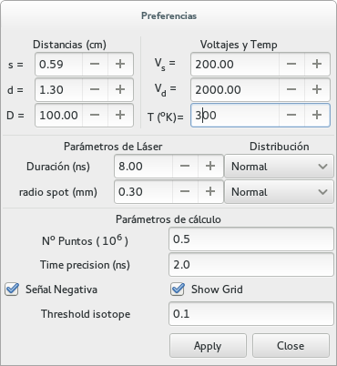

======================
 Programa interactivo
======================

Para iniciar el programa se puede correr desde una línea de comandos con la línea::

  $> tof_gtk

o, como::

  $> tof_gtk.py

El programa interactivo **tof_gtk** trata de ser de uso intuitivamente obvio.
Al iniciarse, uno se encuentra con una ventana similar a la siguiente:

.. image:: tof_inter_inic.png
   :align: center
   :width: 90%
   :alt: Ventana inicial del tof
      
donde ya hemos definido las masas para Kriptón. El botón *Execute* realiza el gráfico de tiempo de vuelos para las masas dadas. Pruébelo ahora!!

Selección de masas
==================

  * Las masas pueden seleccionarse con el *mouse*
  * Una vez seleccionadas pueden removerse con el botón *Remove Selected* en la parte inferior izquierda.
  * La manera más simple de agregar nuevas masas es:

    * Para agregar masas, la manera más simple es agregar la lista de sustancias o fragmentos en el casillero debajo del botón *Add Substances*

    * Las sustancias (una o más, separadas por comas) se escriben en la forma:

      + Kr, Al, Au   (para elementos simples)
      + N2, O2, H2O, CO2, C7H8 (para moléculas, en este caso :math:`N_2, O_2, CO_2, C_7H_8`)

    * Luego, se debe apretar el botón *Add Substances* (o utilizar el shortcut *ALT s*)

    * El casillero *Find isotopes* (seleccionado por *default*) permite buscar todas las combinaciones de isótopos de una dada sustancia con un probabilidad apreciable (configurable, ver :ref:`threshold-isotope`)

    * Este procedimiento da todos los isótopos de una dada sustancia y sus abundancias relativas, según la base de datos de NIST

    * La convención para el *label* es, una lista de los isótopos separada por un guión, donde cada isótopo tiene la forma: 
      Numero de Masa + Símbolo + Número de átomos. 
      Por ejemplo:

      - Para el isótopo de agua común (:math:`H_2O`) tendremos: **1H2-16O1**.  

      - Para agua pesada, donde el átomo de oxígeno es reemplazado por oxígeno-18 (:math:`^{18}O`) será: **1H2-18O1**

  * También se pueden agregar masas en forma manual. Para ello hay que:

    + Agregar filas (botón *Add*)

    + Llenar los tres casilleros de la fila:

      - Especie: es un label de identificación

      - Masa: La masa de la sustancia en UMA. Esta cantidad determina la posición del pico y su ancho.

      - Población: Porcentaje de abundancia de la sustancia. Esta cantidad determina la altura del pico.

Configuración de parámetros
===========================

  * El casillero *Automatic Update* permite ir viendo las modificaciones a los gráficos en tiempo real cuando se modifica alguna tensión

  * El botón *Properties* (*ALT p*) abre una segunda ventana donde se pueden configurar parámetros del TOF y algunas de las condiciones de trabajo.

Ventana de configuración
========================

La ventana de propiedades tiene la forma:

En esta ventana se pueden configurar los parámetros del TOF:

Dimensiones del TOF
~~~~~~~~~~~~~~~~~~~

* Distancia de extracción :math:`s`
* Distancia de aceleración :math:`d`
* Distancia de vuelo libre :math:`D`

Tensiones aplicadas
~~~~~~~~~~~~~~~~~~~

* Voltaje de extracción :math:`V_s`
* Voltaje de aceleración :math:`V_d`
* Temperatura de trabajo :math:`T`

Láser
~~~~~
* Duración del láser y forma temporal del pulso (normal o uniforme)
* Radio del *spot* del láser y perfil del haz (normal o uniforme)

Gráficos
~~~~~~~~

* Señal negativa (simulando la señal del osciloscopio)
* Agregar una grilla para guía visual

.. _threshold-isotope:

Umbral de Isótopos
~~~~~~~~~~~~~~~~~~

El casillero *Threshold isotope* permite definir cuál es la abundancia mínima (porcentual) del isótopo de una dad sustancia a considerar. 
